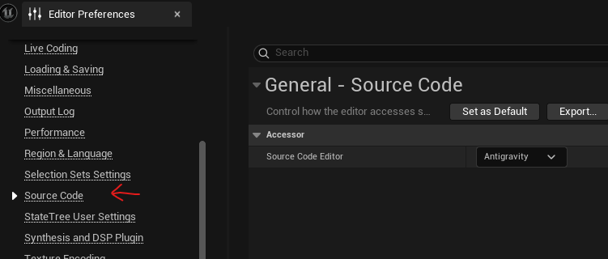

# Antigravity Editor Source Code Accessor for Unreal Engine

A lightweight Unreal Engine plugin that seamlessly integrates the **Antigravity Editor** (a VSCode-based custom editor) as a Source Code Editor within Unreal Engine.

This plugin leverages Unreal Engine's `ISourceCodeAccessor` interface to ensure that clicking on C++ classes, blueprint nodes, or compilation errors inside the Unreal Editor instantly opens the correct file and line number inside your Antigravity Editor workspace.

---

## Features

* **Instant Code Navigation:** Double-click C++ classes or functions in Unreal Engine to jump directly to them in Antigravity.
* **Automatic Workspace Sync:** Bridges Unreal Engine's project structure with Antigravity’s layout.
* **Streamlined Workflow:** Tailored specifically for developers utilizing the Antigravity ecosystem instead of stock VSCode or heavy Visual Studio installations.

---

## Installation

You can install this plugin either locally to a specific project

### Project-Level Installation

1. Navigate to your Unreal Engine project's root directory (where your `.uproject` file is located).
2. Look for a folder named `Plugins`. If it does not exist, create a new folder and name it exactly **`Plugins`**.
3. Clone or extract this repository directly into that folder. Your path layout should look like this:
```text
YourProject/
├── Config/
├── Content/
├── Source/
├── Plugins/
│   └── AntigravitySourceCodeAccess/  <-- Plugin files go here
└── YourProject.uproject
```
---

## Configuration & Setup

Once the plugin is in the correct directory, you need to recompile your project, and then enable it inside your project settings.

### 1. Activating the Plugin (If it is not activated already)

1. Launch your Unreal Engine project.
2. From the top menu, go to **Edit > Plugins**.
3. In the search bar, type **Antigravity**.
4. Check the **Enabled** box next to the Antigravity Source Accessor plugin
5. Restart the Unreal Editor if prompted.

### 2. Setting Antigravity as your Default Editor

1. Go to **Edit > Editor Preferences**.
2. On the left sidebar, navigate to the **General** section and select **Source Code**.
3. In the **Source Code Editor** dropdown menu, select **Antigravity**.




> **Note:** If Antigravity does not appear in the dropdown menu right away, verify that your Antigravity executable path is correctly set up in your system's Environment Variables (`PATH`), or specify the absolute path inside the plugin's configuration settings if prompted.

---


## How It Works & Project File Generation

Because the Antigravity Editor is built on top of a VSCode-based core architecture, it relies on standard `.code-workspace` files to map out your Unreal project. If Unreal Engine falls back to generating Visual Studio (`.sln`) files by default, you can force it to generate a VSCode workspace using any of the three following methods:

### Method 1: The Editor Toggle Trick

1. Go to **Edit > Editor Preferences > Source Code** and temporarily set your editor to **Visual Studio Code**.
2. Close the editor, right-click your `.uproject` file, and select **Generate Project Files**.
3. Once the `.code-workspace` file is generated in your root directory, reopen the project and switch your Source Code Editor preference back to **Antigravity Editor**.

### Method 2: Local Project Configuration Override (Recommended)

You can force the Unreal Build Tool (UBT) to always output VSCode files for this specific project by placing a configuration file inside your project's `Saved` directory:

1. Navigate to your project's `Saved` folder.
2. Create a folder named `UnrealBuildTool` (if it doesn't exist).
3. Copy the file named `BuildConfiguration.xml` from repo inside it 


<details>
<summary>Manually create BuildConfiguration.xml</summary>
You can create the file manually and paste the following configuration:

```xml
<?xml version="1.0" encoding="utf-8" ?>
<Configuration xmlns="https://www.unrealengine.com/BuildConfiguration">
  <ProjectFileGenerator>
    <Format>VisualStudioCode</Format>
  </ProjectFileGenerator>
</Configuration>

```
</details>

### Method 3: Automated Generation via Batch File

Alternatively, you can bypass the editor completely and force-generate the files via a command-line script. Copy `GenerateVSCodeProjectfiles.bat` in your project's root folder and drag&drop your `.uproject` file on it.

---
 Enjoy!